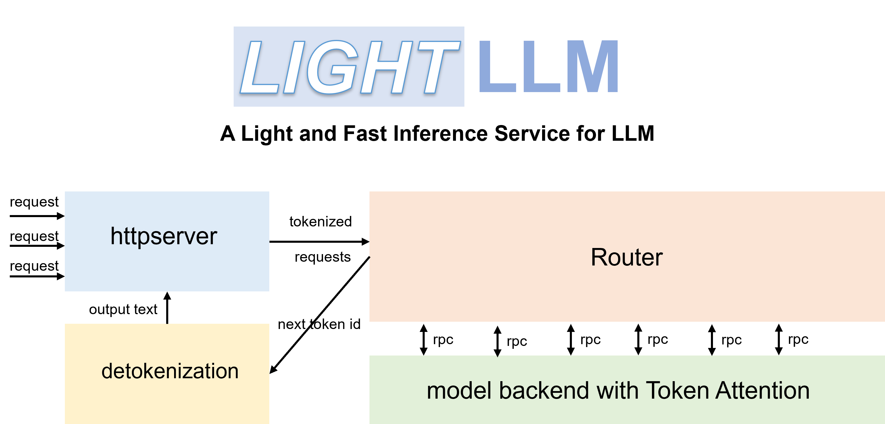

<div align="center">
  <picture>
    
  </picture>
</div>

---
<div align="center">

[](https://github.com/ModelTC/lightllm/blob/main/docs/TokenAttention.md)
[](https://github.com/ModelTC/lightllm/actions/workflows/docker-publish.yml)
[](https://github.com/ModelTC/lightllm)
[](https://discord.gg/WzzfwVSguU)
[](https://github.com/ModelTC/lightllm/blob/main/LICENSE)
</div>

LightLLM is a Python-based LLM (Large Language Model) inference and serving framework, notable for its lightweight design, easy scalability, and high-speed performance. LightLLM harnesses the strengths of numerous well-regarded open-source implementations, including but not limited to FasterTransformer, TGI, vLLM, and FlashAttention.

## Features

- Tri-process asynchronous collaboration: tokenization, model inference, and detokenization are performed asynchronously, leading to a considerable improvement in GPU utilization.
- Nopad (Unpad): offers support for nopad attention operations across multiple models to efficiently handle requests with large length disparities.
- Dynamic Batch: enables dynamic batch scheduling of requests
- [FlashAttention](https://github.com/Dao-AILab/flash-attention): incorporates FlashAttention to improve speed and reduce GPU memory footprint during inference.
- Tensor Parallelism: utilizes tensor parallelism over multiple GPUs for faster inference.
- [Token Attention](./docs/TokenAttention.md): implements token-wise's KV cache memory management mechanism, allowing for zero memory waste during inference.
- High-performance Router: collaborates with Token Attention to meticulously manage the GPU memory of each token, thereby optimizing system throughput.
- Int8KV Cache: This feature will increase the capacity of tokens to almost twice as much. only llama support.

## Supported Model List

- [BLOOM](https://huggingface.co/bigscience/bloom)
- [LLaMA](https://github.com/facebookresearch/llama)
- [LLaMA V2](https://huggingface.co/meta-llama)
- [StarCoder](https://github.com/bigcode-project/starcoder)
- [Qwen-7b](https://github.com/QwenLM/Qwen-7B)
- [ChatGLM2-6b](https://github.com/THUDM/ChatGLM2-6B)
- [Baichuan-7b](https://github.com/baichuan-inc/Baichuan-7B)
- [Baichuan2-7b](https://github.com/baichuan-inc/Baichuan2)
- [Baichuan2-13b](https://github.com/baichuan-inc/Baichuan2)    
- [Baichuan-13b](https://github.com/baichuan-inc/Baichuan-13B)
- [InternLM-7b](https://github.com/InternLM/InternLM)
- [Yi-34b](https://huggingface.co/01-ai/Yi-34B)  
- [Qwen-VL](https://huggingface.co/Qwen/Qwen-VL)
- [Qwen-VL-Chat](https://huggingface.co/Qwen/Qwen-VL-Chat)
- [Llava-7b](https://huggingface.co/liuhaotian/llava-v1.5-7b)
- [Llava-13b](https://huggingface.co/liuhaotian/llava-v1.5-13b)  
- [Mixtral]()
- [Stablelm](https://huggingface.co/stabilityai/stablelm-2-1_6b)
- [MiniCPM](https://huggingface.co/openbmb/MiniCPM-2B-sft-bf16)

> When you start Qwen-7b, you need to set the parameter '--eos_id 151643 --trust_remote_code'.

> ChatGLM2 needs to set the parameter '--trust_remote_code'.

> Baichuan and Baichuan2 needs to set the parameter '--trust_remote_code'.

> InternLM needs to set the parameter '--trust_remote_code'.

> Stablelm needs to set the parameter '--trust_remote_code'.

## Get started

### Requirements

The code has been tested with Pytorch>=1.3, CUDA 11.8, and Python 3.9. To install the necessary dependencies, please refer to the provided **requirements.txt** and follow the instructions as

~~~shell
pip install -r requirements.txt
~~~

### Container

You can use the official Docker container to run the model more easily. To do this, follow these steps:

- Pull the container from the GitHub Container Registry:

    ```shell
    docker pull ghcr.io/modeltc/lightllm:main
    ```

- Run the container with GPU support and port mapping:

    ```shell
    docker run -it --gpus all -p 8080:8080                  \
            --shm-size 1g -v your_local_path:/data/         \
            ghcr.io/modeltc/lightllm:main /bin/bash
    ```

- Alternatively, you can build the container yourself:

    ```shell
    docker build -t <image_name> .
    docker run -it --gpus all -p 8080:8080                  \
            --shm-size 1g -v your_local_path:/data/         \
            <image_name> /bin/bash
    ```

- You can also use a helper script to launch both the container and the server:

    ```shell
    python tools/quick_launch_docker.py --help
    ```

- Note: If you use multiple GPUs, you may need to increase the shared memory size by adding `--shm-size` to the `docker run` command.

### Installation

- Install from the source code by

~~~shell
python setup.py install
~~~

 The code has been tested on a range of GPUs including A100, A800, 4090, and H800. If you are running the code on A100, A800, etc., we recommend using triton==2.1.0 or triton==2.0.0.dev20221202. If you are running the code on H800, etc., it is necessary to compile and install the source code of [triton==2.1.0](https://github.com/openai/triton/tree/main) from the GitHub repository. If the code doesn't work on other GPUs, try modifying the triton kernel used in model inference.
- Install Triton Package

use triton==2.1.0  (Better performance, but the code is under continuous development and may be unstable.)
~~~shell
pip install -U --index-url https://aiinfra.pkgs.visualstudio.com/PublicPackages/_packaging/Triton-Nightly/pypi/simple/ triton-nightly
~~~

use triton==2.0.0.dev20221202 (This version has a memory leak bug. Refer to the [issue #209](https://github.com/ModelTC/lightllm/issues/209) for the fix method. )
~~~shell
pip install triton==2.0.0.dev20221202
~~~

### RUN LLaMA
With efficient Routers and TokenAttention, LightLLM can be deployed as a service and achieve the state-of-the-art throughput performance.

Launch the server:

~~~shell
python -m lightllm.server.api_server --model_dir /path/llama-7B     \
                                     --host 0.0.0.0                 \
                                     --port 8080                    \
                                     --tp 1                         \
                                     --max_total_token_num 120000
~~~

The parameter `max_total_token_num` is influenced by the GPU memory of the deployment environment. A larger value for this parameter allows for the processing of more concurrent requests, thereby increasing system concurrency. For more startup parameters, please refer to [api_server.py](lightllm/server/api_server.py) or [ApiServerArgs.md](docs/ApiServerArgs.md).

To initiate a query in the shell:

~~~shell
curl http://127.0.0.1:8080/generate     \
    -X POST                             \
    -d '{"inputs":"What is AI?","parameters":{"max_new_tokens":17, "frequency_penalty":1}}' \
    -H 'Content-Type: application/json'
~~~

To query from Python:

~~~python
import time
import requests
import json

url = 'http://localhost:8080/generate'
headers = {'Content-Type': 'application/json'}
data = {
    'inputs': 'What is AI?',
    "parameters": {
        'do_sample': False,
        'ignore_eos': False,
        'max_new_tokens': 1024,
    }
}
response = requests.post(url, headers=headers, data=json.dumps(data))
if response.status_code == 200:
    print(response.json())
else:
    print('Error:', response.status_code, response.text)
~~~

### RUN Multimodal Models

##### Run QWen-VL
~~~shell
python -m lightllm.server.api_server \
    --host 0.0.0.0                 \
    --port 8080                    \
    --tp 1                         \
    --max_total_token_num 12000    \
    --trust_remote_code            \
    --enable_multimodal            \
    --cache_capacity 1000          \
    --model_dir /path/of/Qwen-VL or /path/of/Qwen-VL-Chat
~~~

##### Run Llava
~~~shell
python -m lightllm.server.api_server \
    --host 0.0.0.0                 \
    --port 8080                    \
    --tp 1                         \
    --max_total_token_num 12000    \
    --trust_remote_code            \
    --enable_multimodal            \
    --cache_capacity 1000          \
    --model_dir /path/of/llava-v1.5-7b or /path/of/llava-v1.5-13b
~~~

##### Query From QWen-VL
~~~python
import time
import requests
import json
import base64

url = 'http://localhost:8080/generate'
headers = {'Content-Type': 'application/json'}

uri = "/local/path/of/image" # or "/http/path/of/image"
if uri.startswith("http"):
    images = [{"type": "url", "data": uri}]
else:
    with open(uri, 'rb') as fin:
        b64 = base64.b64encode(fin.read()).decode("utf-8")
    images=[{'type': "base64", "data": b64}]

data = {
    "inputs": "</img>Generate the caption in English with grounding:",
    "parameters": {
        "max_new_tokens": 200,
        # The space before <|endoftext|> is important, the server will remove the first bos_token_id, but QWen tokenizer does not has bos_token_id
        "stop_sequences": [" <|endoftext|>"],
    },
    "multimodal_params": {
        "images": images,
    }
}

response = requests.post(url, headers=headers, data=json.dumps(data))
if response.status_code == 200:
    print(response.json())
else:
    print('Error:', response.status_code, response.text)
~~~

##### Query From QWen-VL-Chat
~~~python
import json
import requests
import base64

def run_once(query, uris):
    images = []
    for uri in uris:
        if uri.startswith("http"):
            images.append({"type": "url", "data": uri})
        else:
            with open(uri, 'rb') as fin:
                b64 = base64.b64encode(fin.read()).decode("utf-8")
            images.append({'type': "base64", "data": b64})

    data = {
        "inputs": query,
        "parameters": {
            "max_new_tokens": 200,
            # The space before <|endoftext|> is important, the server will remove the first bos_token_id, but QWen tokenizer does not has bos_token_id
            "stop_sequences": [" <|endoftext|>", " <|im_start|>", " <|im_end|>"],
        },
        "multimodal_params": {
            "images": images,
        }
    }

    # url = "http://127.0.0.1:8080/generate_stream"
    url = "http://127.0.0.1:8080/generate"
    headers = {'Content-Type': 'application/json'}
    response = requests.post(url, headers=headers, data=json.dumps(data))
    if response.status_code == 200:
        print(" + result: ({})".format(response.json()))
    else:
        print(' + error: {}, {}'.format(response.status_code, response.text))

"""
multi-img, multi-round:

<|im_start|>system
You are a helpful assistant.<|im_end|>
<|im_start|>user
</img>
</img>
上面两张图片分别是哪两个城市？请对它们进行对比。<|im_end|>
<|im_start|>assistant
根据提供的信息，两张图片分别是重庆和北京。<|im_end|>
<|im_start|>user
这两座城市分别在什么地方？<|im_end|>
<|im_start|>assistant
"""
run_once(
    uris = [
        "assets/mm_tutorial/Chongqing.jpeg",
        "assets/mm_tutorial/Beijing.jpeg",
    ],
    query = "<|im_start|>system\nYou are a helpful assistant.<|im_end|>\n<|im_start|>user\n</img>\n</img>\n上面两张图片分别是哪两个城市？请对它们进行对比。<|im_end|>\n<|im_start|>assistant\n根据提供的信息，两张图片分别是重庆和北京。<|im_end|>\n<|im_start|>user\n这两座城市分别在什么地方？<|im_end|>\n<|im_start|>assistant\n"
)
~~~

##### Query From Llava
~~~python
import time
import requests
import json
import base64

url = 'http://localhost:8080/generate'
headers = {'Content-Type': 'application/json'}

uri = "/local/path/of/image" # or "/http/path/of/image"
if uri.startswith("http"):
    images = [{"type": "url", "data": uri}]
else:
    with open(uri, 'rb') as fin:
        b64 = base64.b64encode(fin.read()).decode("utf-8")
    images=[{'type': "base64", "data": b64}]

data = {
    "inputs": "A chat between a curious human and an artificial intelligence assistant. The assistant gives helpful, detailed, and polite answers to the human's questions. USER: <image>\nPlease explain the picture. ASSISTANT:",
    "parameters": {
        "max_new_tokens": 200,
    },
    "multimodal_params": {
        "images": images,
    }
}

response = requests.post(url, headers=headers, data=json.dumps(data))
if response.status_code == 200:
    print(response.json())
else:
    print('Error:', response.status_code, response.text)
~~~

> Additional lanuch parameters: `--enable_multimodal`, `--cache_capacity`, larger `--cache_capacity` requires larger `shm-size`

> Support `--tp > 1`, when `tp > 1`, visual model run on the gpu 0

> The special image tag for Qwen-VL is `</img>` (`<image>` for Llava), the length of `data["multimodal_params"]["images"]` should be the same as the count of tags, The number can be 0, 1, 2, ...

> Input images format: list for dict like `{'type': 'url'/'base64', 'data': xxx}`

## Performance

### Service Performance

We compared the service performance of LightLLM and vLLM==0.1.2 on LLaMA-7B using an A800 with 80G GPU memory.

To begin, prepare the data as follows:

~~~shell
wget https://huggingface.co/datasets/anon8231489123/ShareGPT_Vicuna_unfiltered/resolve/main/ShareGPT_V3_unfiltered_cleaned_split.json
~~~

Launch the service:

~~~shell
python -m lightllm.server.api_server --model_dir /path/llama-7b --tp 1 --max_total_token_num 121060 --tokenizer_mode auto
~~~

Evaluation:

~~~shell
cd test
python benchmark_serving.py --tokenizer /path/llama-7b --dataset /path/ShareGPT_V3_unfiltered_cleaned_split.json --num-prompts 2000 --request-rate 200
~~~

The performance comparison results are presented below:

| vLLM                                                 | LightLLM                                              |
| ---------------------------------------------------- | ----------------------------------------------------- |
| Total time: 361.79 s<br/>Throughput: 5.53 requests/s | Total time: 188.85 s<br/>Throughput: 10.59 requests/s |

### Static inference performance

For debugging, we offer static performance testing scripts for various models. For instance, you can evaluate the inference performance of the LLaMA model by

~~~shell
cd test/model
python test_llama.py
~~~

### FAQ

- The LLaMA tokenizer fails to load.
    - consider resolving this by running the command `pip install protobuf==3.20.0`.
- `error   : PTX .version 7.4 does not support .target sm_89`
    - launch with `bash tools/resolve_ptx_version python -m lightllm.server.api_server ... `

## Community

For further information and discussion, [join our discord server](https://discord.gg/WzzfwVSguU).

## License

This repository is released under the [Apache-2.0](LICENSE) license.

## Acknowledgement

We learned a lot from the following projects when developing LightLLM.
- [Faster Transformer](https://github.com/NVIDIA/FasterTransformer)
- [Text Generation Inference](https://github.com/huggingface/text-generation-inference)
- [vLLM](https://github.com/vllm-project/vllm)
- [Flash Attention 1&2](https://github.com/Dao-AILab/flash-attention)
- [OpenAI Triton](https://github.com/openai/triton)
