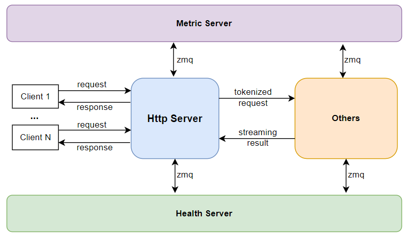

lightllm概述
==========================

lightllm 的设计核心是多进程协作，每个进程负责一个模块，通过zmq和rpc的方式进行多进程协同工作。
lightllm中包括以下的模块：

* **Http Server** ： 负责接收请求
* **Metric Server** ：负责记录系统运行的性能指标
* **Health Server** ：负责监控系统运行的健康情况
* **Router** : 负责调度请求
* **Visual Server** : 负责处理多模态请求
* **Cache Manager Server** ：负责管理多模态信息的推理结果的缓存
* **Model Backend** ：负责管理单个设备的模型推理，可以有若干个

下面我们将逐一讲解重要的模块。

Http Server
-----------------------

当我们重点关注Http Server时，可以看到其在lightllm系统的作用如上图所示，运行时它主要负责：

* 接收API请求
* **对于系统查询请求**，跟 ``Metric Server`` 和 ``Health Server`` 协作获取相关信息
* **针对于纯文本请求**，将文本 tokenized，包装成纯文本请求发送给 ``Router``
* **针对于多模态请求**，获取图片数据的md5码，使用md5码跟 ``Cache Manager Server`` 申请缓存，并将图片数据存到缓存上，将文本 tokenized，和多模态信息一起包装成多模态请求发送给 ``Visual Server``

Router
----------------

.. figure:: ../assets/lightllm/Router.png
  :width: 100%
  :align: center
  :alt: Router
  :class: no-scaled-link

Router 从 ``HttpServer`` 接收请求以后，主要负责保存请求，并且进行 **请求调度**，具体而言，它主要负责：

* 接收 ``HttpServer`` 或者 ``Visual Server`` 发来的请求，并放到请求队列中。
* 决定当前轮次应该 ``prefill`` 还是 ``decode``。
* 如果是 ``prefill`` 轮次， ``prefill`` 哪些请求。
* 如果是 ``decode`` 轮次， ``decode`` 哪些请求。

.. tip::

  具体的调度算法，请阅读：:ref:`Efficient_Router` 。

Model Backend
-----------------

.. figure:: ../assets/lightllm/backend.png
  :width: 100%
  :align: center
  :alt: backend
  :class: no-scaled-link

当 ``Router`` 决定好了使用哪些请求进行 ``prefill`` 或者 ``decode`` 以后， ``ModelBackend`` 决定如何处理这些请求。
``lightllm\server\router\model_infer\mode_backend\base_backend.py`` 目录下的 ``ModeBackend`` 是所有 backend 的基类，通过了解其中的重要函数，可以了解到 backend主要的职责：

* ``init_model`` : 通过模型文件解析使用 ``lightllm-new-docs\lightllm\models`` 的哪个模型类。
* ``prefill_batch`` : 对一个批次数据进行 ``prefill``。
* ``decode_batch`` : 对一个批次数据进行 ``decode``。

每个backend都有一个 ``model``代表一个独立的模型类, 以及一个 ``tp_rank`` 代表一个设备，可以有若干个 ``backend``。
其中的 ``model`` 类负责模型在设备中真正地计算， ``lightllm\common\basemodel\basemodel.py`` 中的 ``TpPartBaseModel`` 是所有模型类的基类，该类支持张量并行。

.. tip::

  关于模型类的详细介绍，请阅读： **如何添加新的模型支持**  章节 。

Visual Server 和 Cache Manager Server
----------------------------------------

.. figure:: ../assets/lightllm/Visual_Server.png
  :width: 100%
  :align: center
  :alt: Visual_Server
  :class: no-scaled-link

``Visual Server`` 和 ``Cache Manager Server`` 都是专门为了支持多模态模型的推理而设计的。其中 ``Visual Server`` 负责 ``encode`` 多模态模型中的图片信息， 
而 ``Cache Manager Server`` 负责缓存图片原始数据和图片 encode 后的特征数据， 该缓存存放在主机的共享内存上，意在减少多进程的重复内存读取以及避免图片数据重复 ``encode``。
