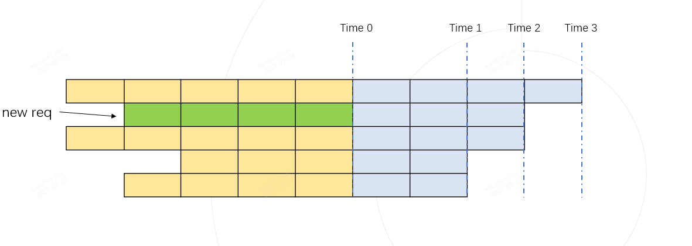
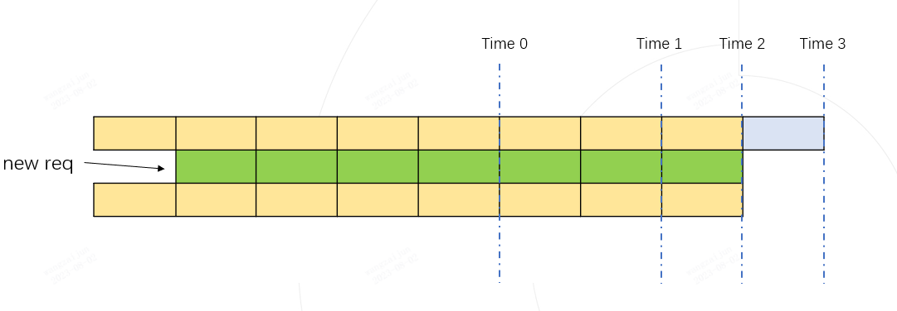

.. _Efficient_Router:

Efficient Router
===================

The Efficient Router is introduced to manage incoming requests and dynamically determine whether the request can be fused with a batch that is already running for inference. The merging criterion is to estimate whether the maximum token occupancy in the merged inference process is smaller than the maximum capacity that the hardware can be accommodated. Here, we set this maximum capacity as max_total_token_num. With the support of Token Attention, we can accurately manage the usage of tokens, and can ensure that there is never a risk of out-of-memory (OOM).

As shown in the figure above, each row represents the current running state of a request, the yellow colour represents the historical kv cache tokens that have been run, each grid represents a token, the grey colour represents the tokens to be generated. The number of tokens to be generated is determined by the maximum output length set for each request and the number of tokens that have been generated. In the above figure, the second row of the green grid represents a newly arrived request, and the figure lists all the requests in ascending order according to the length of the output to be generated.

If we assume that the new requests are fused into a Batch for inference, the maximum token usage will inevitably occur at one of the time points, Time 1, Time 2, or Time 3. We only need to calculate if the token usage at these three time points does not exceed the max_total_token_num, which indicates that the new request can be added to the Batch for fused inference.

The total used tokens of Time 1 is equal to the number of yellow cells plus the number of green cells (see the figure below)

.. image:: ../assets/lightllm/ER2.png
   :alt: Efficient_Router1
   :align: center

The total used tokens of Time 2 is equal to the number of yellow squares plus the number of green squares (see the figure below)

The total used tokens of Time 3 is equal to the number of yellow squares (see the figure below)

.. image:: ../assets/lightllm/ER4.png
   :alt: Efficient_Router1
   :align: center

The actual maximum token usage is always one of Time 1, Time 2, or Time 3.

As long as the maximum token usage during the dynamic inference process is lower than max_total_token_num, it indicates that new requests can be batched for inference.

To quickly calculate the maximum token usage required for all requests in a batch, we have implemented an efficient example using numpy.

.. code-block:: python

    import numpy as np

    def demo():
        max_total_token_num = 100
        req_list = [(5, 4), (4, 3), (5, 3), (3, 2), (4, 2)]  # (run_len, left_output_len)
        req_list.sort(key=lambda x: -x[1])

        left_out_len_array = np.array([e[1] for e in req_list])
        has_run_len_array = np.array([e[0] for e in req_list])
        cum_run_len_array = np.cumsum(has_run_len_array)
        size_array = np.arange(1, len(req_list) + 1, 1)
        need_max_token_num = (left_out_len_array * size_array + cum_run_len_array).max()

        if need_max_token_num <= max_total_token_num:
            print("ok")
        else:
            print("oom")