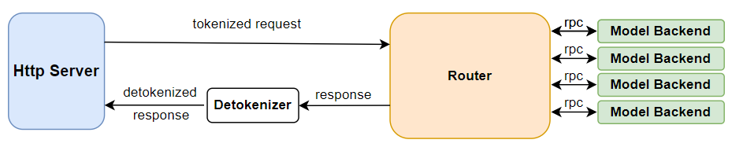
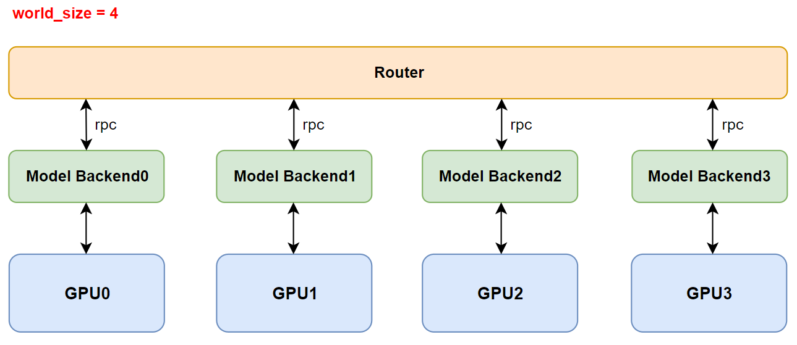
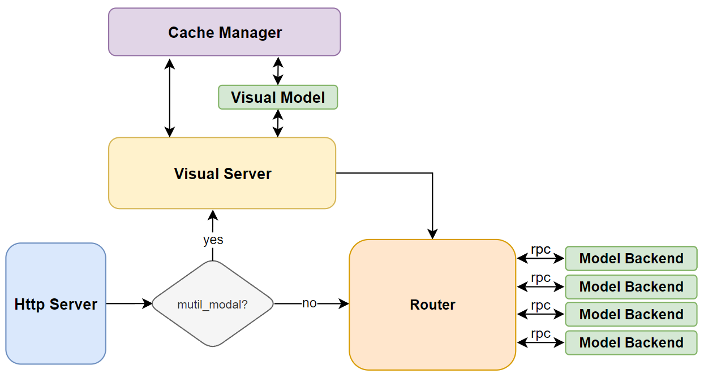

Lightllm Architecture
==========================

The core design of lightllm is multi-process collaboration. Each process is responsible for a module, and multi-process collaboration is carried out through zmq and rpc.
lightllm includes the following modules:

* **Http Server** ： Responsible for receiving requests
* **Metric Server** ：Responsible for recording the performance indicators of system operation
* **Health Server** ：Responsible for monitoring the health of system operations
* **Router** : Responsible for scheduling requests
* **Visual Server** : Responsible for handling multimodal requests
* **Cache Manager Server** ：Responsible for managing the cache of inference results of multimodal information
* **Model Backend** ：Responsible for managing model inference for a single device. There can be several

Below we will explain the important modules one by one.

Http Server
-----------------------

.. figure:: ../assets/lightllm/HttpServer.png
  :width: 100%
  :align: center
  :alt: HttpServer
  :class: no-scaled-link

When we focus on **Http Server**, we can see its role in the lightllm system as shown in the figure above. At runtime, it is mainly responsible for:

* Receiving API Requests
* **For system query requests**, collaborate with ``Metric Server`` and ``Health Server`` to retrieve relevant information.
* **For plain text requests**, tokenize the text, wrap it as a plain text request, and send it to the ``Router``.
* **For multimodal requests**, obtain the MD5 hash of the image data, use the MD5 hash to request a cache from the ``Cache Manager Server``, store the image data in the cache, tokenize the text, and package the text along with the multimodal information into a multimodal request to be sent to the ``Visual Server``.

Router
----------------

After the Router receives a request from the ``HttpServer``, it is mainly responsible for storing the request and **request scheduling**. Specifically, it is responsible for:

* Receiving requests sent by the ``HttpServer`` or ``Visual Server`` and placing them into the request queue.
* Deciding whether the current round should be ``prefill`` or ``decode``.
* If it is a ``prefill`` round, determining which requests to ``prefill``.
* If it is a ``decode`` round, determining which requests to ``decode``.

.. tip::

  For the detailed scheduling algorithm, please refer to: :ref:`Efficient_Router`.

Model Backend
-----------------

After the ``Router`` decides which requests to use for ``prefill`` or ``decode``, the ``ModelBackend`` determines how to process these requests. The ``ModeBackend`` in the ``lightllm\server\router\model_infer\mode_backend\base_backend.py`` directory is the base class for all backends. By understanding its key functions, you can learn the main responsibilities of the backend:

* ``init_model``: Parses the model file to determine which model class from ``lightllm-new-docs\lightllm\models`` to use.
* ``prefill_batch``: Performs ``prefill`` on a batch of data.
* ``decode_batch``: Performs ``decode`` on a batch of data.

Each backend has a ``model`` that represents an independent model class, and a ``tp_rank`` that represents a device. There can be several ``backends``. The ``model`` class is responsible for the actual computation on the device, and the ``TpPartBaseModel`` in ``lightllm\common\basemodel\basemodel.py`` is the base class for all model classes, supporting tensor parallelism.

.. tip::

  For a detailed introduction to the model classes, please refer to the **How to Add New Model Support** section.

Visual Server 和 Cache Manager Server
----------------------------------------

The ``Visual Server`` and ``Cache Manager Server`` are specifically designed to support the inference of multimodal models. The ``Visual Server`` is responsible for ``encoding`` image information in multimodal models, while the ``Cache Manager Server`` handles caching the original image data and the encoded feature data. This cache is stored in the host's shared memory to reduce redundant memory reads across multiple processes and to avoid repeated ``encoding`` of image data.

