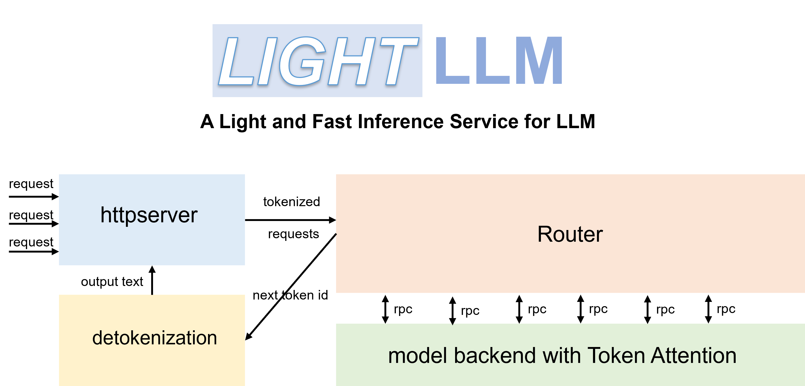

# LightLLM：A Pure Python, Lightweight and High-Performance LLM Inference Framework

With the popularity of ChatGPT, large language model, abbreviated as LLM, has received increasing attention. The emergence of such models has greatly improved people's work efficiency. However, the key to further widespread adoption lies in how to deploy models with billons of parameters at low cost and high throughput. To improve the throughput of large model services and enable more interested researchers to quickly get involved, a lightweight LLM inference service framework called LightLLM has emerged. LightLLM introduces a more fine-grained kv cache management algorithm called TokenAttention and designs an Efficient Router scheduling implementation that works efficiently with TokenAttention. **Through the interaction of TokenAttention and Efficient Router, LightLLM achieves higher throughput than vLLM and Text Generation Inference in most scenarios, with performance improvements of around 4 times in some cases. LightLLM is flexible, user-friendly, and efficient. Interested friends may want to click on the link below to try it out.**

Project：[https://github.com/ModelTC/lightllm](https://github.com/ModelTC/lightllm)

## The challenge of LLM Serving

Large language models have garnered significant attention from researchers due to their excellent performance. These models not only engage in everyday conversations with humans but also assist in completing various daily tasks, thereby enhancing productivity. However, despite the remarkable performance demonstrated by these models, deploying large-scale models to improve service performance poses the following challenges:

- Severe fragmentation of memory: Network weights ranging from tens to hundreds of gigabytes, as well as the constantly dynamic growing KV Cache during inference, easily leads to low memory utilization.
- Low efficiency in request scheduling: The length of requests dynamically changes over time, which can result in GPU idling or low utilization issues.
- High difficulty in kernel customization: Customizing kernels for networks is necessary to efficiently utilize memory and improve service throughput. However, it will require a significant amount of effort from researchers.

## Existing solutions and problems

To address the aforementioned challenges, many excellent LLM inference frameworks have emerged, such as FasterTransformer, Text-Generation-Inference (referred to as TGI), vLLM, etc. The core features and capability matrices of these frameworks are shown in the table below:

| Framework | NV Triton + FasterTransformer | TGI | vLLM | LightLLM |
| --- | --- | --- | --- | --- |
| core feature | Efficient kernel | [Continuous batch](https://github.com/huggingface/text-generation-inference/tree/main/router), Token streaming | [PageAttention](https://vllm.ai/) |  Tri-process asynchronous collaboration，[Token Attention](https://github.com/ModelTC/lightllm/blob/main/docs/TokenAttention.md)，Efficient Router |
| Memory fragmentation | low | high | low | low |
| Request scheduling efficiency | low | middle | middle | high |
| Difficulty of kernel customization | high | middle | middle | low |

These frameworks all have their own unique features. For example, FasterTransformer has excellent static inference performance but lacks robust service scheduling and is primarily developed in C++, resulting in high secondary development costs. TGI has excellent service interfaces and scheduling features such as Continuous Batch, but its inference performance, scheduling strategy, and memory management have some shortcomings. vLLM has excellent memory management but lacks efficiency in request scheduling, and its overall implementation details are more suitable for deploying small models.

## LightLLM

Therefore, to address these issues, we have developed a LLM deployment framework called LightLLM, which is based on the pure Python language. It enables researchers to easily deploy and customize lightweight models locally, allowing for rapid expansion of different models and integration of various excellent open-source features. The core features of LightLLM are as follows:

- Tri-process asynchronous collaboration: tokenization, model inference, and detokenization are performed asynchronously, leading to a considerable improvement in GPU utilization.
- [Token Attention](https://github.com/ModelTC/lightllm/blob/main/docs/TokenAttention.md): implements token-wise's KV cache memory management mechanism, allowing for zero memory waste during inference.
- Efficient Router: collaborates with Token Attention to meticulously manage the GPU memory of each token, thereby optimizing system throughput.

With the highly coordinated efficient kernels developed based on OpenAI Triton and service scheduling, LightLLM achieves excellent throughput performance



### Token Attention

Transformers form the basis of modern large language models. During autoregressive decoding, these models cache key-value tensors of context tokens into GPU memory to facilitate fast generation of the next token. However, these caches occupy significant GPU memory. The unpredictable nature of cache size, due to the variability in the length of each request, exacerbates the issue, resulting in significant memory fragmentation in the absence of a suitable memory management mechanism.

Therefore, we introduce TokenAttention, an attention mechanism that manages key and value caching at the token level and implement high-performance kernels and efficient memory allocation and release operation. The operation mechanism of TokenAttention is illustrated in the figure below:


1. During model initialization, the KV cache is pre-allocated based on the user-set max_total_token_num and a Token Table is created to record the actual storage locations of input tokens.

2. When handling new requests, the system first checks for available contiguous space in the pre-allocated Token cache for storing the key-value (KV) cache. TokenAttention favors assigning contiguous graphics memory space for requests to minimize memory access during the inference process. Only when contiguous space is insufficient does it allocate non-contiguous graphics memory for the requests. The allocated space is recorded in the Token Table for subsequent attention calculations.

3. For cache of newly generated tokens, it is only necessary to find unused space from the pre-allocated token cache and add the corresponding entry to the Token Table. Moreover, to efficiently allocate and release the Cache, we utilize the parallel computing capabilities of torch Tensor on the GPU to manage the state of the pre-allocated Token Cache. First, we define the states as follows:

```python
self.mem_state = torch.ones((size,), dtype=torch.bool, device="cuda")
self._mem_cum_sum = torch.empty((size,), dtype=torch.int32, device="cuda")
self.indexes = torch.arange(0, size, dtype=torch.long, device="cuda")
self.can_use_mem_size = size
```
The **mem_state** records the usage status of the cache, where 1 represents unused and 0 represents used. The **_mem_cum_sum** is used for the cumulative sum of **mem_state** which is used to efficiently identify and select unused space for cache allocation. The allocation process is as follows:

```python
torch.cumsum(self.mem_state, dim=0, dtype=torch.int32, out=self._mem_cum_sum)
select_index = torch.logical_and(self._mem_cum_sum <= need_size, self.mem_state == 1)
select_index = self.indexes[select_index]
self.mem_state[select_index] = 0
self.can_use_mem_size -= len(select_index)
```
It can be observed that our cache state management is all done on the GPU, fully utilizing the parallel capabilities of torc, thereby allowing the system to efficiently allocate cache space for each request.

4. Upon completion of requests, the corresponding graphics memory can be quickly freed by deleting their records on the Token Table, which makes way for scheduling new requests.

```python
self.can_use_mem_size += free_index.shape[0]
self.mem_state[free_index] = 1
```

5. Token Attention allows for zero wastage of GPU memory, due to its GPU memory management at the token level. It can accurately calculate how many new tokens the system can accommodate for computation. Therefore, when combined with a high-performance router to manage requests, it can continuously add new requests during the inference process, fully utilizing every piece of GPU memory and maximizing GPU utilization.

### Efficient Router

The Efficient Router is introduced to manage incoming requests and dynamically determine whether the request can be fused with a batch that is already running for inference. The merging criterion is to estimate whether the maximum token occupancy in the merged inference process is smaller than the maximum capacity that the hardware can be accommodated. Here, we set this maximum capacity as max_total_token_num. With the support of Token Attention, we can accurately manage the usage of tokens, and can ensure that there is never a risk of out-of-memory (OOM).


As shown in the figure above, each row represents the current running state of a request, the yellow colour represents the historical kv cache tokens that have been run, each grid represents a token, the grey colour represents the tokens to be generated. The number of tokens to be generated is determined by the maximum output length set for each request and the number of tokens that have been generated. In the above figure, the second row of the green grid represents a newly arrived request, and the figure lists all the requests in ascending order according to the length of the output to be generated.

If we assume that the new requests are fused into a Batch for inference, the maximum token usage will inevitably occur at one of the time points, Time 1, Time 2, or Time 3. We only need to calculate if the token usage at these three time points does not exceed the max_total_token_num, which indicates that the new request can be added to the Batch for fused inference.

The total used tokens of Time 1 is equal to the number of yellow cells plus the number of green cells (see the figure below)


The total used tokens of Time 2 is equal to the number of yellow squares plus the number of green squares (see the figure below)


The total used tokens of Time 3 is equal to the number of yellow squares (see the figure below)


The actual maximum token usage is always one of Time 1, Time 2, or Time 3.

As long as the maximum token usage during the dynamic inference process is lower than max_total_token_num, it indicates that new requests can be batched for inference.

To quickly calculate the maximum token usage required for all requests in a batch, we have implemented an efficient example using numpy.

```
import numpy as np

def demo():
    max_total_token_num = 100
    req_list = [(5, 4), (4, 3), (5, 3), (3, 2), (4, 2)]  # (run_len, left_output_len)
    req_list.sort(key=lambda x: -x[1])

    left_out_len_array = np.array([e[1] for e in req_list])
    has_run_len_array = np.array([e[0] for e in req_list])
    cum_run_len_array = np.cumsum(has_run_len_array)
    size_array = np.arange(1, len(req_list) + 1, 1)
    need_max_token_num = (left_out_len_array * size_array + cum_run_len_array).max()

    if need_max_token_num <= max_total_token_num:
        print("ok")
    else:
        print("oom")
```

## Performance

We conducted performance comparisons on the ShareGPT_Vicuna_unfiltered dataset using the current mainstream inference frameworks TGI, NV Triton + FasterTransformer, and vLLM. The results are shown in the graph below. It can be observed that LightLLM achieves higher throughput across different model sizes. TGI suffers from severe memory fragmentation, making it difficult to achieve high throughput. vLLM introduces PageAttention but due to its overall implementation details being more favorable for small model inference, its concurrent performance on large models is not very ideal (using default configurations). In contrast, LightLLM maintains robust performance across various model sizes and achieves around a 2-3x improvement over TGI and vLLM on large models (LLaMA-65B).


**TGI Compatibility & Ablation Analysis** To further validate the effectiveness of TokenAttention and Router, we also integrated these features into TGI to address its memory fragmentation issue, as shown in the figure below (left). It can be observed that introducing TokenAttention and Router leads to more than a 4x performance improvement compared to the original TGI.

**Improvement in case of mixed long and short requests**：From the figure below (left), it can be noticed that the introduction of Router did not bring a more significant performance improvement, which is due to the fact that the difference in the question length of ShareGPT_Vicuna_unfiltered's dataset is not significant. For this reason, we constructed a collection of requests with a greater difference in the length, and verified the performance of our Efficient Router. The results are shown below (right). It can be seen that our Efficient Router can make better use of GPU resources, and can bring about nearly 50% performance improvement with requests that have large differences in question lengths.


The left figure shows the compatibility of LightLLM and TGI and the ablation analysis, and the right figure shows the enhancement of our Efficient Router with the long and short request

## Future Work

- Support for more models
- router scheduling enhancements
- High-performance int8 int4 weight only support and int8 kv cache.
- Fully quantized models
- Mixed-precision models
- Sparsification

LightLLM is committed to enabling more people to participate, allowing flexible and efficient exploration of various LLM deployment and inference solutions. It also serves as a reference for hardware manufacturers to promote the development of the field. We hope that everyone can give it more stars, fork the project, and contribute. We believe that in the future, more technologies and solutions (such as TensorRT) will emerge, continuously reducing deployment costs and making AGI more accessible to ordinary households.