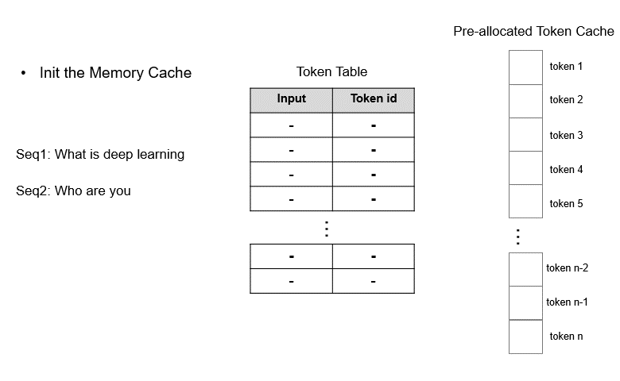

# TokenAttention

Transformers form the basis of modern large language models. During autoregressive decoding, these models cache key-value tensors of context tokens into GPU memory to facilitate fast generation of the next token. However, these caches occupy significant GPU memory. The unpredictable nature of cache size, due to the variability in the length of each request, exacerbates the issue, resulting in significant memory fragmentation in the absence of a suitable memory management mechanism.

To alleviate this issue, PagedAttention was proposed to store the KV cache in non-contiguous memory spaces. It partitions the KV cache of each sequence into multiple blocks, with each block containing the keys and values for a fixed number of tokens. This approach effectively controls memory waste within the last block during attention computation. While PagedAttention alleviates memory fragmentation to some extent, it still leaves room for memory waste. Additionally, when handling multiple high-concurrency requests, the allocation and deallocation of memory blocks fall short of efficiency, leading to suboptimal memory utilization.

To address the above challenges, we introduce TokenAttention, an attention mechanism that manages key and value caching at the token level. Compared to PagedAttention, our TokenAttention not only minimizes memory fragmentation and enables efficient memory sharing but also facilitates efficient memory allocation and deallocation. It allows for more precise and fine-grained memory management, thus optimizing memory utilization.

| Features                                     | PagedAttention | TokenAttention |
| -------------------------------------------- | :------------: | :------------: |
| Low memory fragmentation                     |    &#x2713;    |    &#x2713;    |
| Efficient memory sharing                     |    &#x2713;    |    &#x2713;    |
| Efficient memory allocation and deallocation |    &#x2717;    |    &#x2713;    |
| Fine-grained memory management               |    &#x2717;    |    &#x2713;    |

The operation mechanism of TokenAttention is illustrated in the figure below:

    

During model initialization, the KV cache is pre-allocated based on the user-set **max_total_token_num** and a Token Table is created to record the actual storage locations of input tokens.

When handling new requests, the system first checks for available contiguous space in the pre-allocated Token cache for storing the key-value (KV) cache. TokenAttention favors assigning contiguous graphics memory space for requests to minimize memory access during the inference process. Only when contiguous space is insufficient does it allocate non-contiguous graphics memory for the requests. Since memory management is conducted on a token-by-token basis, TokenAttention achieves nearly zero waste, yielding higher throughput compared to vllm.

We have implemented an efficient TokenAttention operator using OpenAI Triton. When provided with a query vector, this operator can efficiently retrieve the corresponding KV cache based on the Token Table and conduct the attention computation.

Upon completion of requests, the corresponding graphics memory can be quickly freed by deleting their records on the Token Table, which makes way for scheduling new requests. Given that TokenAttention pre-allocates all KV cache space during model initialization, it can efficiently release memory for completed requests and merge different batches of requests during dynamic scheduling, thereby effectively maximizing GPU utilization.
